# Bandit Online Games - Frontend Documentation

Welcome to the frontend documentation for the **Bandit Online Games** platform. This guide focuses on the **Player Role
** and **Admin Role**, detailing all the features, pages, and interactions available. The platform provides a seamless
experience for browsing, purchasing, and playing games, as well as administrative controls for managing game content and
player analytics.

---

## Table of Contents

### Player Role

- [Overview](#overview)
- [Game Store](#game-store)
    - Add to Cart
    - Info Popups
    - Purchase and Redirect
- [My Games](#my-games)
    - Play Now
    - Play with Friends
    - Info
- [Profile Page](#profile-page)
    - Overview
    - Game Achievements
    - Friends Management
    - Mandatory Profile Setup
- [Chatbot Interaction](#chatbot-interaction)

### Admin Role

- [Add New Game](#add-new-game)
- [Game Achievements Management](#game-achievements-management)
- [Statistics](#statistics)
- [Analytics](#analytics)
- [Predictions](#predictions)

---

## Overview

The **Player Role** in Bandit Online Games allows users to browse available games, make purchases, and play online with
friends or random players. The **Admin Role** provides tools for managing game content, tracking player activities, and
analyzing platform usage data.

---

## Game Store

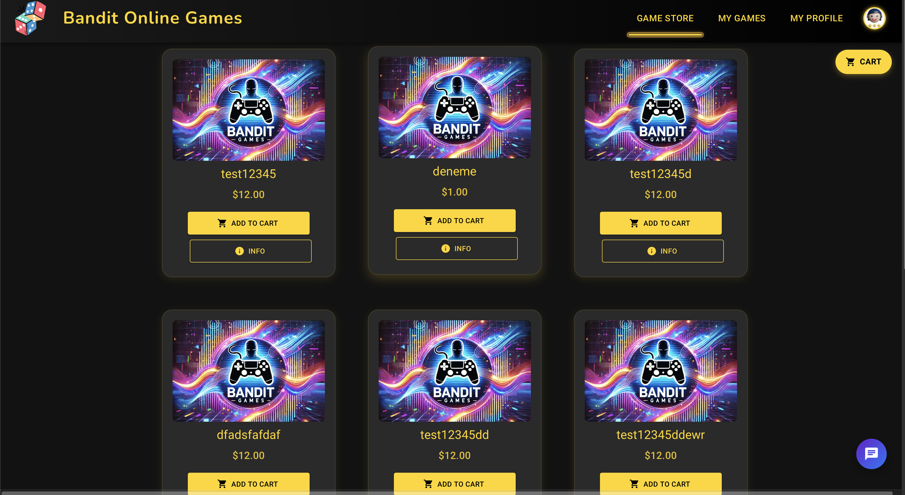

### Purpose

The Game Store displays a list of games available for purchase. Players can explore detailed information about each game
and add their favorite games to the cart.

### Key Features

#### Browsing Games

- Each game card includes:
    - Game Image
    - Game Name
    - Price

#### Add to Cart

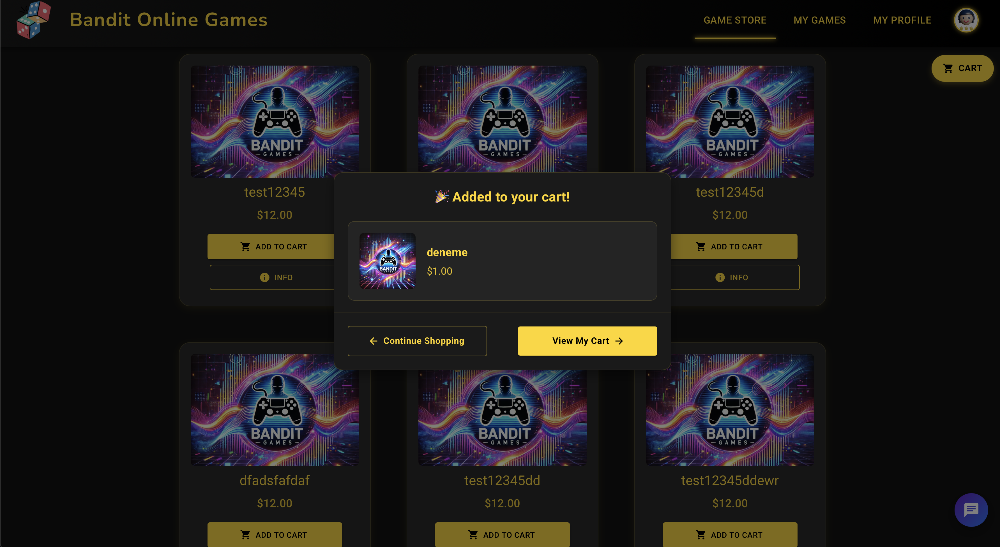
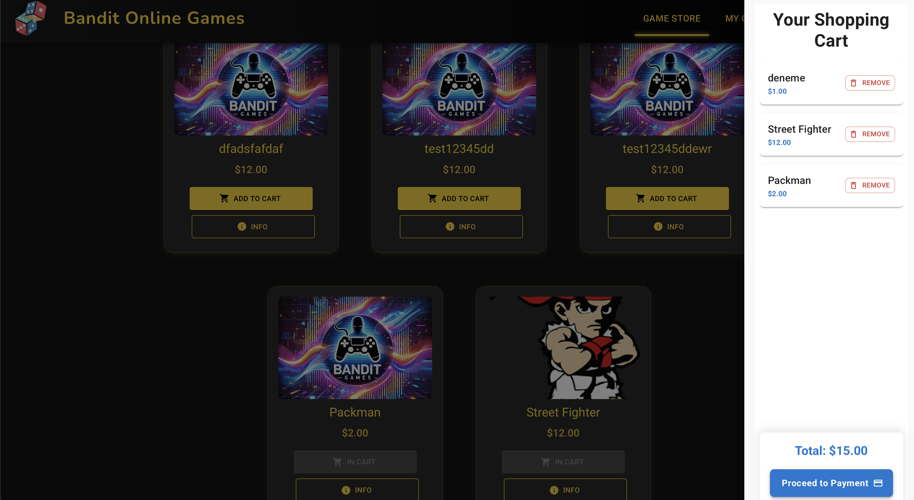

1. Click the **Add to Cart** button below a game card to add the game to your shopping cart.
2. Once added, a confirmation popup appears with options to:
    - **Continue Shopping**
    - **View My Cart**

#### Info Popups

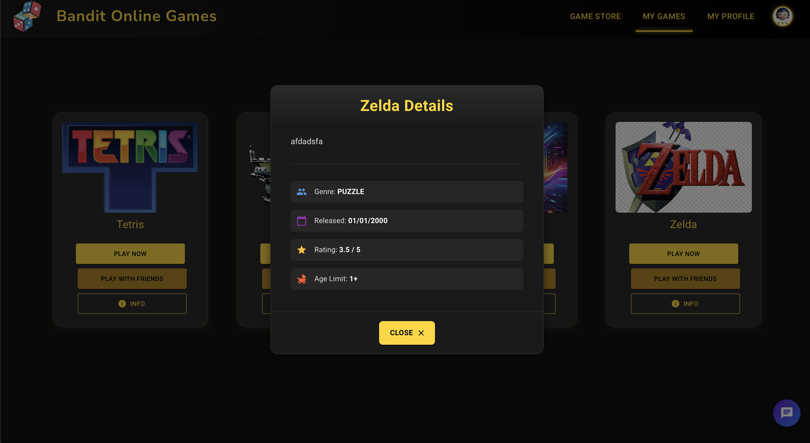

1. Click the **Info** button below a game card to view detailed information about the game.
    - Details include:
        - Genre
        - Release Date
        - Rating
        - Age Limit
        - Price
2. Close the info popup by clicking the **Close** button.

#### Purchasing Games

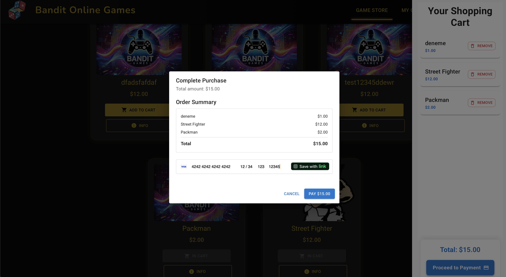

1. Open your cart by clicking **View My Cart**.
2. Review the items and click **Proceed to Payment**.
3. Enter your payment details and click **Pay** to complete the purchase.
4. Upon successful payment, a message displays: "Purchase successful! Redirecting to 'My Games'..."
5. After a 3-second wait, the platform redirects you to the **My Games** page.

---

## My Games

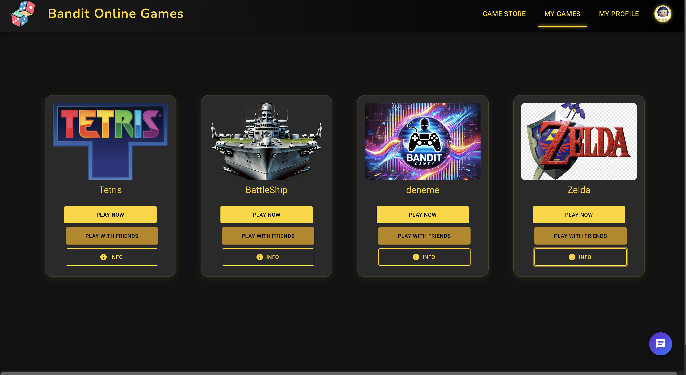

### Purpose

The My Games page lists all the games purchased by the player. Players can start a game, invite friends, or view game
details from this page.

### Key Features

#### Play Now

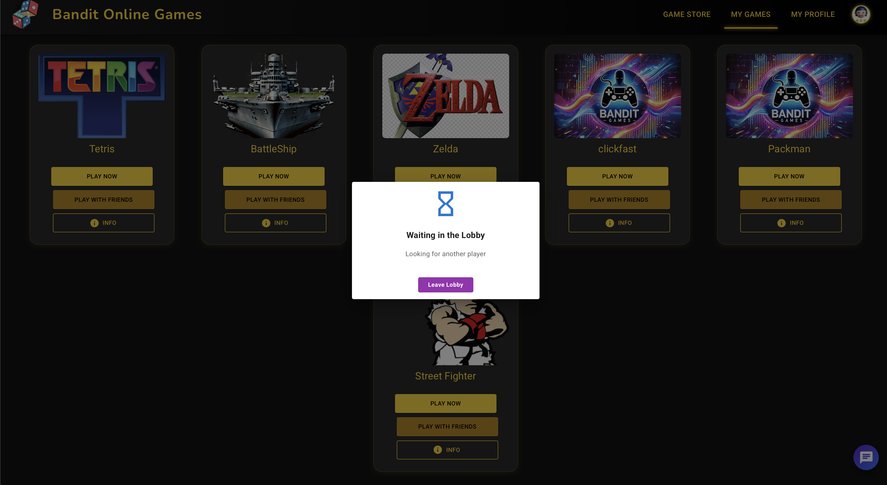

1. Click **Play Now** on a game card to start the game immediately.
2. A popup displays "Waiting in the Lobby" while the system searches for other players.
3. Once a match is found, the game starts automatically.
4. To cancel matchmaking, click the **Leave Lobby** button in the popup.

#### Play with Friends

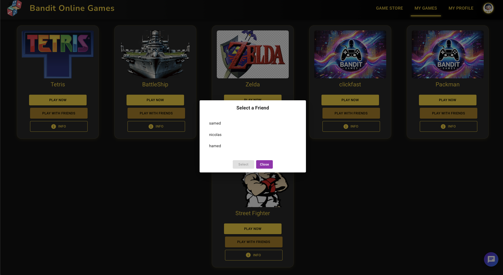

1. Click **Play with Friends** on a game card to invite friends to play.
2. A popup displays your friend list. Select a friend to send an invitation.
3. If no friends are linked, the message "No friends available" appears.

#### Info

1. Click the **Info** button on a game card to view detailed game information.
    - Note: For purchased games, the price is not displayed.
2. Close the info popup by clicking the **Close** button.

---

## Profile Page

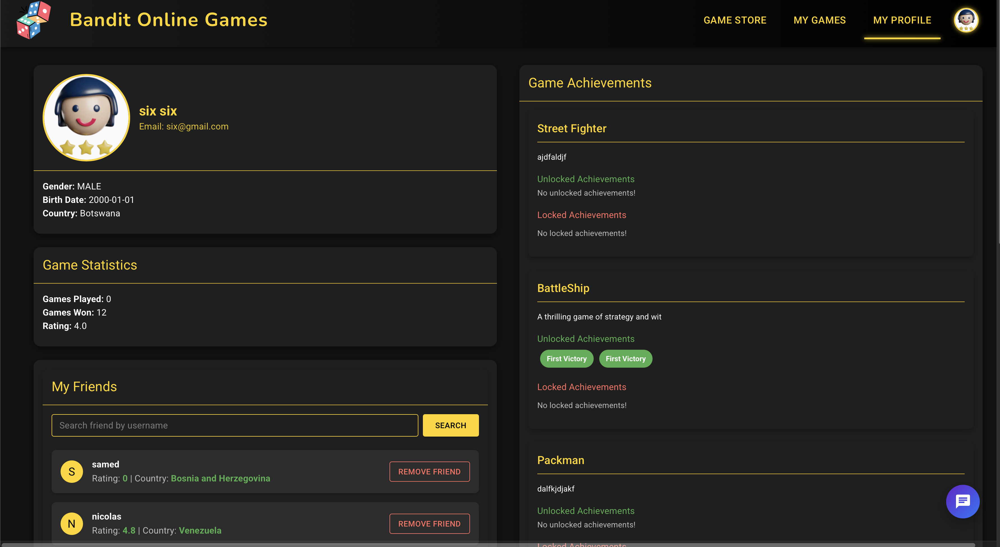

### Purpose

The Profile Page allows users to view and manage their personal details, track game achievements, and manage their
friends.

### Key Features

#### Overview

1. Displays the user's avatar, name, email, gender, birthdate, and country.
2. Provides quick access to game statistics.

#### Game Achievements

1. View all achievements for each game:
    - **Unlocked Achievements**: Lists achievements the player has earned (e.g., "First Victory").
    - **Locked Achievements**: Lists achievements that are yet to be earned.
2. Games with no achievements display a message: "No unlocked achievements."

#### Friends Management

1. Search for friends by username using the **Search** bar.
    - If the user is already a friend, a message displays: "Already Friends."
    - If the user is not a friend, an **Add Friend** button is available.
    - If no matching users are found, a message displays: "No users found."
2. View the list of current friends, including:
    - Name
    - Country
    - Rating
3. Remove friends using the **Remove Friend** button.

#### Mandatory Profile Setup

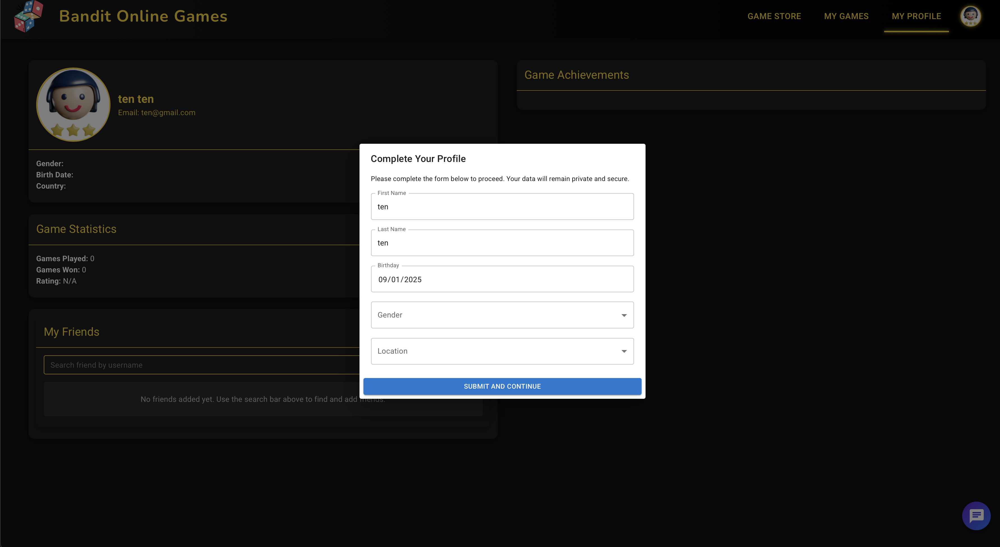

1. First-time users must fill out a profile setup popup to proceed:
    - Gender
    - Country
    - Birthdate
2. Click **Submit and Continue** to save details and access the platform.

---

## Chatbot Interaction

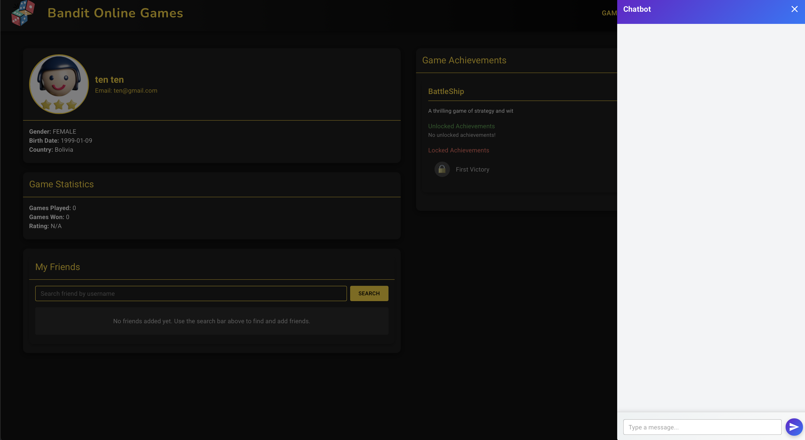

### Purpose

The chatbot provides an interactive way for players to ask questions and get help.

### Key Features

1. Open the chatbot by clicking the chat icon in the bottom-right corner.
2. Type a message or question in the input box and click the **Send** button.
3. The chatbot responds with helpful information or troubleshooting steps.
    - If the chatbot is unable to generate a response, an error message displays: "A response could not be generated."

---

## Admin Role

### Add New Game

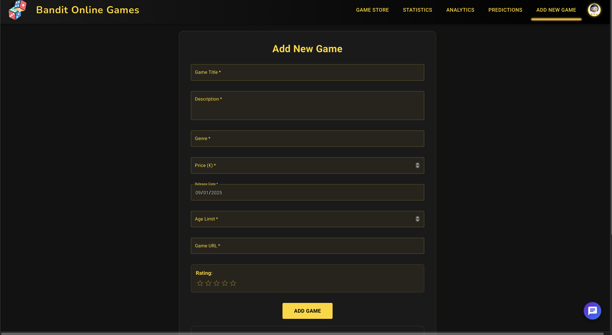

### Purpose

Allows admins to add new games to the platform.

### Key Features

1. Fill in the following fields:
    - Price (€)
    - Release Date
    - Age Limit
    - Game URL
    - Rating (out of 5)
2. Add Game Achievements:
    - Upload a JSON file containing achievements.
3. Click the **Add Game** button to save the game to the platform.

---

### Game Achievements Management

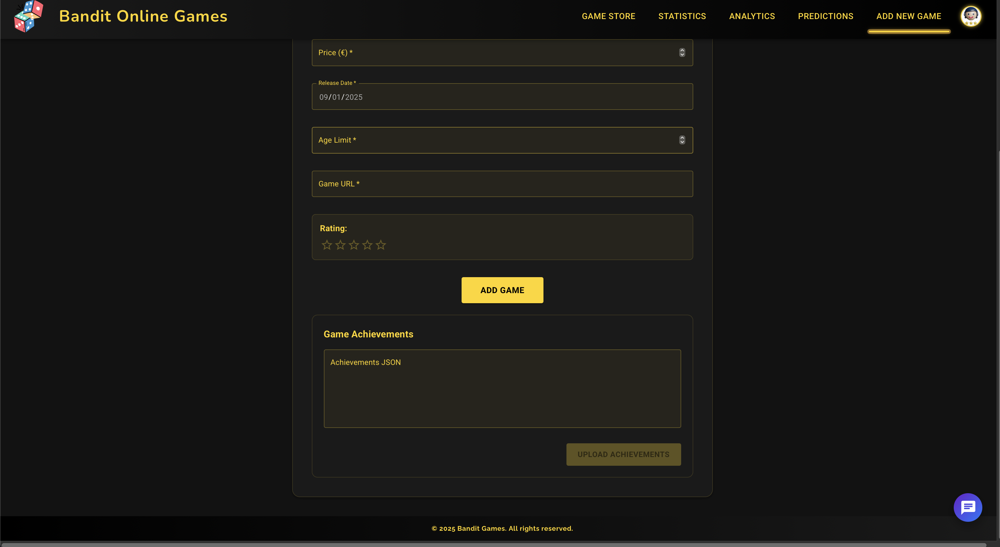

### Purpose

Admins can manage the achievements for games on the platform.

### Key Features

1. Upload or modify achievement data using JSON files.
2. Update existing game achievements as required.

---

### Statistics

### Purpose

Provides real-time data about player activities and game performance.

### Key Features

1. Displays overall statistics:
    - Total Moves
    - Total Wins and Losses
    - Total Time Played (Minutes)
2. Allows filtering by:
    - Country
    - Age
    - Game Name
    - Gender

---

### Analytics

### Purpose

Visualize platform data to track trends and performance.

### Key Features

1. **Top 5 Played Games**: Displays the most popular games on the platform.
2. **Top Players Per Game**: Lists the top-performing players for each game.

---

### Predictions

### Purpose

Utilizes player and game data to generate insights and forecasts.

### Key Features

1. Predicts future trends in game popularity and player activity.
2. Provides suggestions for platform improvements based on predictive analytics.

---

This document will be updated as new features are developed for both **Player Role** and **Admin Role**. Stay tuned for
further updates!

